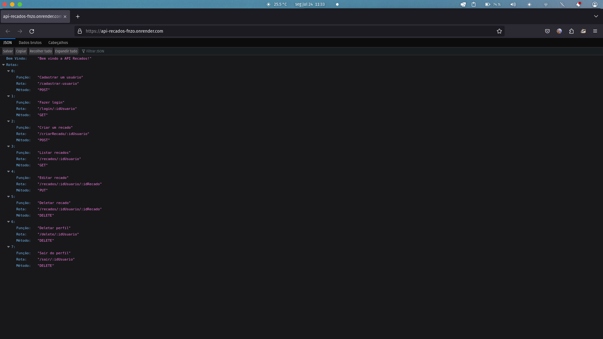
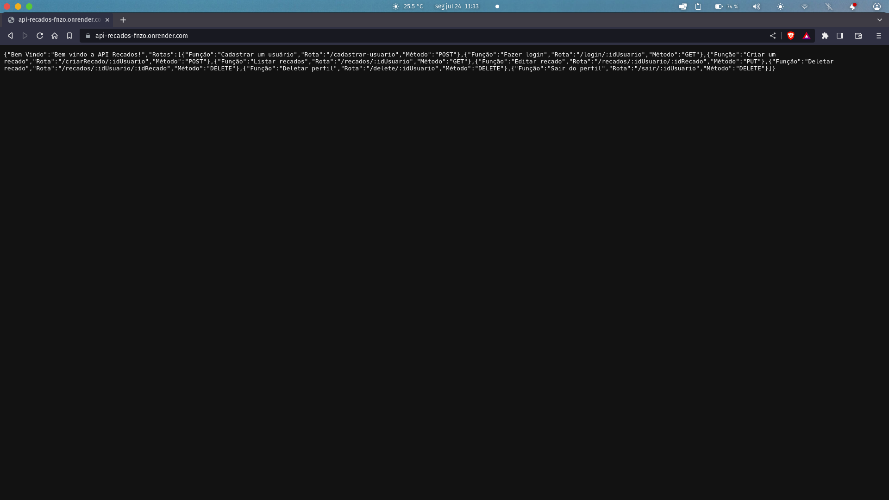
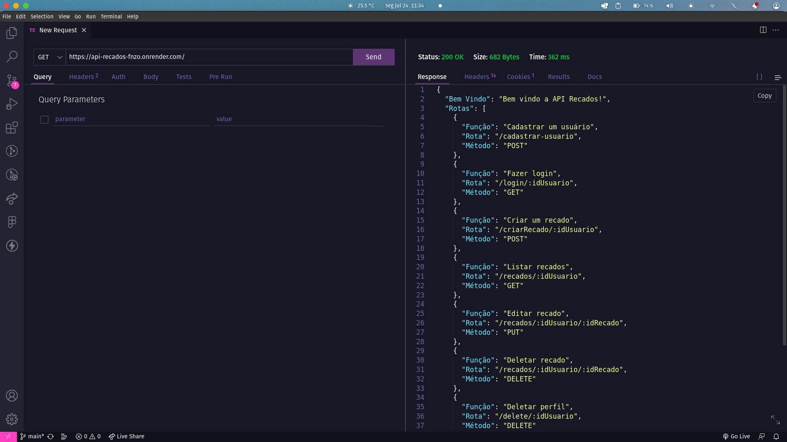

#  API REST - CRUD DE RECADOS

O projeto consistiu em criar uma API REST para um CRUD (Create, read, update and delete) de recados.  Foram usados os conhecimentos adquiridos em javascript e nodejs, junto com a lib express do gerenciador de pacotes npm. 

<h3> Usando o link </h3>
Uma opção de rodar a API REST direto, é usando o <a href="https://api-recados-fnzo.onrender.com/">link</a>.
Usando o link para acessar pelo navegador, não é possível fazer as requisições, para isso será necessário ter uma plataforma de API , recomendo o uso do Postamn ou da extensão Thunder client do VS code.
Basta pegar o link e colar na área de requisição, aguardar o carregamento e seguir as instruções. Lembre-se de usar o método GET.

<pre> https://api-recados-fnzo.onrender.com/ </pre>

Caso seja o primeiro acesso, pode demorar um pouco, e isso é normal! Caso fique sem usar por mais de 24h também, então fique tranquilo caso isso aconteça.

Caso faça siga a primeira opção, não precisa fazer a próxima.

<h3> Clonando o repositório </h3>

Outra opção é fazer um clone do projeto, através do comando: 
<pre>git clone https://github.com/ProgSamuel/Avaliacao_final_introducao_ao_back_end.git </pre> 

Dessa forma, será feito um clone do projeto em seu computador. 
A partir daqui, você precisará abrir a pasta através da sua interface de desenvolvimento, e fazer as instalações necessárias, rodando o :
<pre> npm init </pre> 

Ao rodar o npm init, basta apertar enter em todas as perguntas e o :
<pre> npm install express </pre>

Feito isso, basta iniciar o projeto  no terminal com o comando
<pre> node index </pre>
Aqui o index é o nome do arquivo, caso altere o nome do arquivo de entrada, lembre-se de alterar aqui também.

<h3> Rodando a API REST </h3>
Feito isso, basta usar a extensão thunder client, para fazer uma nova requisição através do seu servidor local, para isso pode usar a seguinte URL:
<pre> http://localhost:3000/ </pre>
A partir daqui, basta seguir o passo a passo indicado.

Abaixo está algumas possíveis visualizações do projeto rodando em sua home.

Se acessar o link usando o navegador Mozilla Firefox, essa será sua visualização:

Se acessar o link usando o navegador brave ou algum com base no Google Chrome, essa será sua visualização:
 

Se acessar o link usando a extensão thunder client, essa será sua visualização:
 

